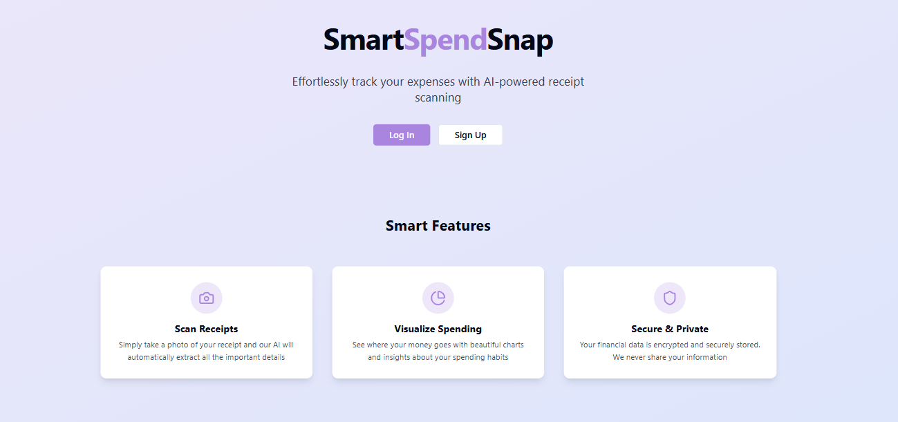

<div align="center">

# 💸 SmartSpendSnap

### AI-Powered Personal Finance Tracker — Scan, Track & Save Smarter

[](https://react.dev/)
[](https://www.typescriptlang.org/)
[](https://tailwindcss.com/)
[](https://firebase.google.com/)
[](https://ai.google.dev/)
[](https://vitejs.dev/)
[](LICENSE)

<br/>

**[🐛 Report Bug](https://github.com/JayeshJadhav28/smart-spend-snap/issues) · [✨ Request Feature](https://github.com/JayeshJadhav28/smart-spend-snap/issues) · [👤 Portfolio](https://jayeshjadhav.com/)**

<br/>



</div>

---

## 📌 Table of Contents

- [About](#-about)
- [System Architecture](#-system-architecture)
- [Features](#-features)
- [Tech Stack](#-tech-stack)
- [Getting Started](#-getting-started)
- [Project Structure](#-project-structure)
- [Contributing](#-contributing)
- [Author](#-author)

---

## 🧠 About

**SmartSpendSnap** is an AI-powered personal finance web application built to make expense tracking effortless and intelligent. Many people struggle with money management — manual tracking is tedious, error-prone, and rarely provides useful insights.

SmartSpendSnap changes that by combining **Google Gemini AI**, **real-time Firestore**, and **interactive data visualization** into one clean, beginner-friendly dashboard.

> Scan a receipt → AI extracts the data → Get personalized savings tips. Done. 💡

**Built at a Hackathon** — tackling real-world financial literacy challenges for students, professionals, and families.

---

## 🗺 System Architecture

```
Authentication → Dashboard
                    ├── Show Saving Rate
                    ├── Show Expense / Income / Balance
                    ├── Financial Tips
                    └── Transaction Input Methods
                            ├── Manually Input Transaction
                            ├── Scan Receipt with Camera
                            └── Import Transactions from Device
                                        ↓
                              [ GEMINI AI PROCESSING ]
                                ├── Process Scanned Receipts
                                ├── Extract Data from Receipts (OCR)
                                └── Generate Personalized Suggestions
                                        ↓
                    ├── Visualize Spending Data → Spending Trends
                    └── Show Gemini AI Suggestions
```

---

## ✨ Features

| Feature | Description |
|---|---|
| 📷 **Receipt Scanner** | Capture or upload receipts — Gemini AI extracts all transaction data via OCR |
| 🤖 **AI Suggestions** | Real-time personalized savings tips & spending alerts powered by Gemini |
| 🗂️ **Auto-Categorisation** | Income & expenses automatically sorted into categories |
| 📊 **Visual Reports** | Interactive charts (pie, monthly overview) built with Recharts |
| 📥 **Gmail Integration** | Scan your inbox for digital receipts automatically |
| 📄 **Spreadsheet Export** | Export all transactions as a downloadable spreadsheet |
| 💱 **Currency Converter** | On-the-go multi-currency support |
| 🔐 **Secure Auth** | Firebase Authentication — Google login & email/password |
| 📱 **Responsive Design** | Fully optimised for mobile, tablet & desktop |

---

## 🛠 Tech Stack

<div align="center">

| Layer | Technology |
|---|---|
| **Frontend** | [React 18](https://react.dev/) + [TypeScript](https://www.typescriptlang.org/) |
| **Build Tool** | [Vite](https://vitejs.dev/) |
| **Styling** | [Tailwind CSS](https://tailwindcss.com/) + [shadcn/ui](https://ui.shadcn.com/) |
| **AI / OCR** | [Google Gemini API](https://ai.google.dev/) |
| **Backend** | [Node.js](https://nodejs.org/) + [Express.js](https://expressjs.com/) |
| **Auth** | [Firebase Authentication](https://firebase.google.com/docs/auth) |
| **Database** | [Firestore](https://firebase.google.com/docs/firestore) (Real-time) |
| **Charts** | [Recharts](https://recharts.org/) |
| **Gmail API** | Google OAuth2 — inbox receipt scanning |

</div>

---

## 🚀 Getting Started

### Prerequisites

```bash
node  >= 18.x
npm   >= 9.x
```

### Installation

```bash
# 1. Clone the repository
git clone https://github.com/JayeshJadhav28/smart-spend-snap.git

# 2. Navigate into the project
cd smart-spend-snap

# 3. Install dependencies
npm install

# 4. Set up environment variables
cp .env

# 5. Start the development server
npm run dev
```

Open [http://localhost:5173](http://localhost:5173) 🎉

### Available Scripts

```bash
npm run dev        # Start Vite dev server
npm run build      # Build for production
npm run preview    # Preview production build
npm run lint       # Run ESLint
```

---

## 📁 Project Structure

```
smart-spend-snap/
├── public/                    # Static assets
├── src/
│   ├── api/                   # Auth API helpers
│   ├── components/
│   │   ├── charts/            # Recharts components
│   │   │   ├── CategoryPieChart.tsx
│   │   │   └── MonthlyOverviewChart.tsx
│   │   ├── FinancialTips.tsx  # AI tips display
│   │   ├── GmailIntegration.tsx
│   │   ├── Layout.tsx
│   │   └── ui/                # shadcn/ui components
│   ├── context/
│   │   └── AuthContext.tsx    # Global auth state
│   ├── hooks/                 # Custom React hooks
│   ├── lib/
│   │   ├── firebase.ts        # Firebase init
│   │   ├── gemini.ts          # Gemini AI integration ⭐
│   │   ├── gmail.ts           # Gmail API integration
│   │   └── currency.ts        # Currency conversion
│   ├── pages/                 # App pages / routes
│   │   ├── Dashboard.tsx      # ⭐ Main dashboard
│   │   ├── AddTransaction.tsx
│   │   ├── Reports.tsx
│   │   └── Login / Signup
│   └── types/                 # TypeScript interfaces
├── .env.example               # ✅ Safe env template
├── vite.config.ts
└── tailwind.config.ts
```

---

## 🤝 Contributing

```bash
git checkout -b feature/your-feature-name
git commit -m "feat: your feature description"
git push origin feature/your-feature-name
# Open a Pull Request 🚀
```

---

## 👤 Author

**Jayesh Jadhav**

[](https://github.com/JayeshJadhav28)
[](https://jayeshjadhav.com/)

---

<div align="center">

⭐ **If SmartSpendSnap helped you, drop a star!** ⭐

Built with ❤️, React & Gemini AI — at a Hackathon 🏆

</div>
